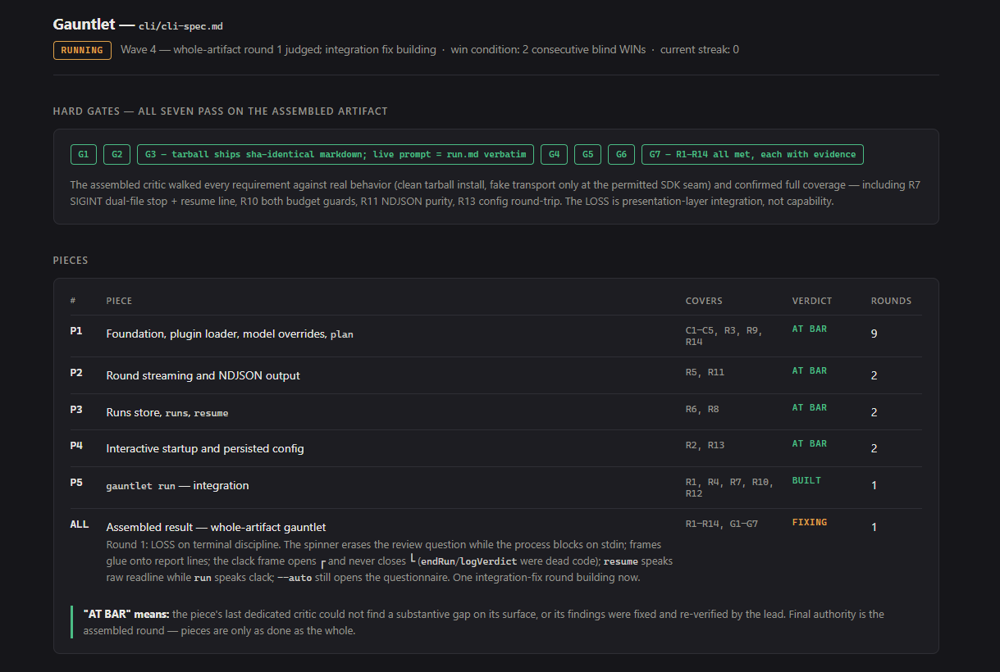

# Exolvra Genesis

*A minimal orchestration loop for Claude Code: builders vs. blind critics,
against a concrete quality bar, until the work actually wins. A small,
self-contained excerpt of [Exolvra OS](https://exolvra.ai).*



*The progress page during a real run — the run that built this repo's own
CLI, judged against `gh` and `@clack/prompts` transcripts.*

## The problem

Coding agents grade their own homework. They report "done" based on their own
narration, stop at "looks good," and never compare their output against
anything real. Exolvra Genesis replaces self-assessment with adversarial evidence:
every round, a fresh-context critic puts the actual output side by side with a
concrete quality bar — blind, labels shuffled — and the loop doesn't end until
the assembled work wins that comparison twice in a row.

## How it works

1. **Pick the bar.** An artifact or a number, never an adjective — real
   screenshots of the product you're chasing, a benchmark figure, a reference
   document. Captured locally into `.exolvra-genesis/bar/`, immutable for the run.
   User constraints become hard gates checked before every comparison.
   A visual bar needs a browser or screenshot tool available to critics —
   without one they report BLOCKED rather than judging pixels from source.
2. **Decompose.** The lead splits the goal into the smallest independently
   judgeable pieces and writes a Task Spec for each, then shows you the bar
   and the piece list and waits for "go" (or runs straight through in `auto`
   mode).
3. **Build.** A `exolvra-genesis-builder` subagent implements one spec end to end.
   Its report is a claim — the lead re-runs the verification command itself
   before anything proceeds.
4. **Judge.** A fresh `exolvra-genesis-critic` sees only the bar and the real output.
   WIN or LOSS, the single biggest gap, and the evidence. A tie is a LOSS.
5. **Loop.** Gaps go back to builders with a fresh critic each round. A gap
   that survives two rounds forces a change of approach. Whole-artifact rounds
   and regression checks keep the pieces honest together.

A live progress page (`.exolvra-genesis/progress.html`) shows the round log,
per-piece status, the latest side-by-side, and verdict history while it runs,
with per-round snapshots under `.exolvra-genesis/runs/`. The page is rendered from a
template shipped with the plugin — the lead only ever swaps out one JSON
block — so every run, on every user's machine, gets the same card.

## Quickstart

```
/plugin marketplace add Evolvlabsai/Exolvra-Genesis
/plugin install exolvra-genesis@exolvra-genesis
/exolvra-genesis:run Build a landing page indistinguishable from <your reference>
```

Exolvra Genesis shows you the bar and the piece list, then waits. Reply `go` to start
the loop. Add `.exolvra-genesis/` to your project's `.gitignore`.

## Running from a spec

Pass a path instead of a goal:

```
/exolvra-genesis:run specs/checkout-flow.md
```

The spec becomes the source of truth — it supplies the goal, the constraints
(as hard gates), and the acceptance criteria, and it's read-only for the run.
Pieces are derived from its requirements, full requirement coverage is a hard
gate for the assembled result, and the final report maps every requirement to
the evidence that satisfies it. The bar still applies: the spec tells the
critics what must be true; the bar tells them what good looks like.

## No spec yet? Interview

`/exolvra-genesis:interview` turns an idea into a run-ready spec by asking one
question at a time — the thing itself, tech stack, must-haves, hard gates,
non-goals, references — then builds a single-file interactive HTML mockup
and iterates on it with you in the browser. The approved mockup lands in the
spec's references as the primary visual bar candidate, and the command ends
by printing the exact `/exolvra-genesis:run` line to fire. Point it at an existing
spec to modify the pair instead of starting over.

## Headless & CI

Prefix the arguments with `auto` and Exolvra Genesis won't pause for bar approval —
it prints the bar and the piece list, then keeps going. Combined with Claude
Code's headless mode, a full run is one line from any shell, script, or CI
job:

```
claude -p "/exolvra-genesis:run auto specs/checkout-flow.md" \
  --permission-mode acceptEdits --max-turns 80
```

Add `--output-format stream-json` for machine-readable events, and treat
`--max-turns` as your cost guard — it stops the run at the cap instead of
looping forever. Prefer to approve the bar even when headless? Run without
`auto`, capture the session id from `--output-format json`, review the
printed bar, then continue with `claude -p --resume <session-id> "go"`. To
embed the same loop inside your own tools, the Claude Agent SDK runs this
exact harness as a TypeScript or Python library — the CLI below is that
embedding, shipped.

## The CLI

`cli/` holds `exolvra-genesis`, a thin TypeScript CLI on the Claude Agent SDK that
runs the loop without opening Claude Code. It is transport and ergonomics
only: the plugin markdown stays the single source of truth — the CLI loads
`commands/run.md` and both agent files from the installed package at runtime
(`EXOLVRA_GENESIS_PLUGIN_DIR` or `--plugin-dir` override the location), so CLI and
plugin behavior cannot drift.

Not yet on npm; build it from the repo:

```
cd cli && npm install && npm run build && npm link
```

Five commands:

- `exolvra-genesis interview [spec-or-idea]` — the interview, as a terminal
  conversation: each question renders in the frame, your typed answer resumes
  the session, and the handoff prints the exact `exolvra-genesis run` line (with
  `-C` when you ran it elsewhere). TTY-only, touches no run state.
- `exolvra-genesis run <goal-or-spec-path>` — the full loop. On a terminal with
  nothing else to go on it asks for the goal, the models, and auto vs review;
  answers persist as the next run's defaults (`--no-config` to ignore them).
  `--auto` skips the bar-approval pause, `--max-rounds N` and `--max-cost USD`
  stop a run cleanly and resumably, `--json` emits NDJSON ending in a
  `{status, rounds, cost_usd, session_id}` summary for CI, and `--open` opens
  the live progress page.
- `exolvra-genesis plan <goal-or-spec-path>` — Steps 0–2 only: prints the bar and
  the task specs, then stops. A cheap preview of how a run would decompose.
- `exolvra-genesis runs` — recent runs: id, when, input, status, last verdict.
- `exolvra-genesis resume [id]` — continue a run in the session it started in; bare
  `resume` offers a picker of unfinished runs.

`--model` pins the lead by exact model id; `--builder-model` and
`--critic-model` take a model *family* (`opus`, `sonnet`, `haiku`, or
`inherit`) — the SDK pins subagents to a family, not a version, and the CLI
says so rather than pretending otherwise. Exit codes are a contract:
**0** the run met its win condition, **1** it lost, was blocked, or was
stopped by a budget guard, **2** the invocation itself has to change.
`exolvra-genesis help exit-codes` and `exolvra-genesis help environment` cover the rest —
there is no flag table here because `--help` makes it unnecessary.

## The two contracts

Everything rides on two small formats.

**Task Spec (lead → builder):** goal · acceptance criteria · files owned
(disjoint per parallel builder) · verification command · bar reference and
gates.

**Report (builder → lead):** files changed · commands run · verbatim
verification output. Nothing else. A report the lead can't reproduce by
re-running the verification command is a LOSS.

## Choosing models

Both agents ship with `model: inherit` — they run on whatever your session
runs on, so the plugin works on any plan at any budget. To split roles, pin
models in the agent frontmatter:

```yaml
# agents/builder.md
model: claude-opus-4-8   # strong implementer
```

A common recipe: run the session (the lead) on your strongest model, since
orchestration is judgment-heavy but token-light; pin builders to a strong
implementation model, where the token volume actually goes; leave critics on
`inherit`.

## Optional: the gates

Two hook examples turn the loop's conventions into mechanisms. Copy either
`hooks` block into your project's `.claude/settings.json` to enable it; both
are off by default and nothing depends on them.

- `hooks/verification-gate.example.json` — a Stop hook that refuses to let a
  session end while `.exolvra-genesis/state.json` still says `running`: the win
  condition, mechanized.
- `hooks/bar-integrity-gate.example.json` — a PreToolUse hook that re-checks
  the bar's sha256 pins (`.exolvra-genesis/bar/bar.sha256`, written at capture)
  before every subagent dispatch: a tampered or drifted bar blocks the next
  builder or critic from ever being sent. The bar's immutability, mechanized.

## What it is not

- **Not a framework.** The plugin is two agents, two commands, and one page
  template — plain Markdown, no config file, no state database, no required
  MCP servers, small enough to read in minutes. The CLI is an optional
  companion, not a wrapper: it loads that same Markdown rather than
  reimplementing the loop, and if the two could drift, the design is wrong.
- **Not a CI system.** It runs inside a Claude Code session and ends when the
  work wins; your CI still owns the repo.
- **Not a prompt library.** There is exactly one loop, and the bar — not the
  prompt — is what you customize per task.

## Part of Exolvra

Exolvra Genesis is a small excerpt of a much bigger machine. It is the
genesis phase of **Exolvra OS** distilled: the interview, the spec, a mockup
you approve by using it, and a build loop that ends only when the work beats
a bar nobody graded on trust.

[Exolvra OS](https://exolvra.ai) applies the same discipline to the whole
life of an application. Specs are approved at doors and recorded immutably.
Human decisions are enforced by the platform, not promised by a prompt. The
loop you just read about keeps going after genesis — through delivery,
release, and operations — with an audit trail behind everything.

And [Exolvra](https://exolvra.ai) is the workplace those agents do it in:
the right software for your agents. Not another chat window — a project
board where work is assigned, real tools to do it with, and reviews before
anything ships.

If this repo's philosophy clicks for you — evidence over claims, verdicts
over vibes — the full platform is the same idea grown up.
**[Join the waitlist →](https://exolvra.ai)**

## Credits

The pattern originates with Matt Shumer's Claude-of-Duty experiment. Exolvra Genesis
generalizes it — quality-bar rules, blind shuffled judging, anti-simulation
gates, and the two handoff contracts — while keeping the original's minimal
spirit.

## License

[MIT](LICENSE)
